<div align="center">
  
  <h1>thor-cosmos</h1>
  <p><em>NVIDIA Cosmos on Jetson AGX Thor — one <code>justfile</code>, one Strands agent, full lifecycle.</em></p>
  <p>
    <a href="https://pypi.org/project/thor-cosmos/"></a>
    <a href="https://python.org"></a>
    <a href="LICENSE"></a>
    <a href="https://github.com/cagataycali/awesome-strands-agents"></a>
    <a href="https://cagataycali.github.io/thor-cosmos/"></a>
  </p>
</div>

---

**thor-cosmos** is a Strands agent + `justfile` that orchestrates the full NVIDIA Cosmos ecosystem and deploys it on **Jetson AGX Thor** for real-time robot perception.

Wraps **Cosmos-Reason2** (VLM), **Cosmos-Predict2.5** (world model), **Cosmos-Transfer2.5** (ControlNet), and **Cosmos-Xenna** (data curation) — every pipeline is a `just` recipe that agents *and* operators share.

```
 Operator CLI         Strands Agent
      │                     │
      │  just <recipe>      │  cosmos_*()
      │                     │
      └─────────────────────┴─────────┐
                                      ▼
                              ┌───────────────┐
                              │   justfile    │  ← EVERYTHING lives here
                              │  (42 recipes) │
                              └───────────────┘
                                      │
                      ┌───────────────┼───────────────┐
                      ▼               ▼               ▼
               tensorrt-edgellm-*   torchrun     curl/gst/nats
               (quant/export)      (train/distill) (serve/io)
```

---

## Why the `justfile` pattern?

- **Same muscle memory as upstream**: every Cosmos repo (`cosmos-predict2.5`, `cosmos-transfer2.5`, `cosmos-reason2`, `cosmos-cookbook`) already ships a `justfile`. Ours blends in.
- **One source of truth**: agents shell out to `just <recipe>`; operators run `just <recipe>` directly. Zero duplication.
- **Thin Python tools**: each `@tool` is ~30 lines that invokes a recipe and maps output → Strands `ToolResult`.
- **Discoverable**: `just --list` prints every pipeline step.
- **Composable**: `pipeline-edge-deploy` chains `download → quantize → export-llm → export-visual`.

---

## Installation

```bash
brew install just                         # (or: curl -LsSf https://get.casey.rs | bash)
pipx install thor-cosmos
thor-cosmos                               # start the agent
```

From source:

```bash
git clone https://github.com/cagataycali/thor-cosmos
cd thor-cosmos
just install                              # venv + pip install -e .
just run                                  # start agent REPL
```

On Jetson Thor (rsync from laptop, run via tmux):

```bash
# From your laptop:
just deploy-thor cagatay@thor.local ~/thor-cosmos

# On Thor:
ssh cagatay@thor.local
tmux new -s thor 'cd ~/thor-cosmos && just run'
```

---

## Tools ↔ Recipes

| Tool (agent) | `just` recipe (CLI) |
|---|---|
| `cosmos_model_download` | `just download <name>` / `just download-dataset <name>` |
| `cosmos_quantize` | `just quantize <model_dir> <output_dir> <dtype> <quantization>` |
| `cosmos_export_onnx` (llm) | `just export-llm <model_dir> <output_dir>` |
| `cosmos_export_onnx` (visual) | `just export-visual <model_dir> <output_dir> <dtype> <quant>` |
| `cosmos_build_engine` (llm) | `just build-llm-engine <onnx_dir> <engine_dir> ...` |
| `cosmos_build_engine` (visual) | `just build-visual-engine <onnx_dir> <engine_dir>` |
| `cosmos_serve(start\|stop\|status\|logs\|restart)` | `serve-start` / `serve-stop` / `serve-status` / `serve-logs` / `serve-restart` |
| `cosmos_inference` | `just infer <image> <prompt>` |
| `cosmos_reason_hf` | HF Transformers direct (no recipe) |
| `rtp_capture_frame` | `just rtp-capture <port> <out> <w> <h> <timeout>` |
| `nats_publish` | `just nats-publish <subject> <payload_json>` |
| `cosmos_predict_generate` | `just predict-generate <input.json>` |
| `cosmos_transfer_generate` | `just transfer-generate <input.json> <control>` |
| `cosmos_post_train(reason2\|predict2_5\|transfer2_5)` | `post-train-reason2` / `post-train-predict` / `post-train-transfer` |
| `cosmos_distill` | `just distill <teacher> <student> <method> <family>` |
| `cosmos_curate` | `just curate <input> <output> <stages>` |
| `cosmos_evaluate` | `just evaluate <metric> <pred> <gt>` |
| `system_info` | `just sysinfo` |
| `video_probe` / `video_extract_frames` | `just video-probe` / `just video-frames` |
| `image_read` | — (read + embed JPEG bytes) |

---

## Pipelines (composed recipes)

```bash
# Full x86 model prep (download → quantize → export-llm → export-visual)
just prep-edge-model reason2-2b ./models/Cosmos-Reason2-2B-fp8

# Flagship edge deployment (intbot_edge_vlm)
just pipeline-edge-deploy reason2-2b ./models/Cosmos-Reason2-2B-fp8

# GR00T-Dreams synthetic trajectories
just pipeline-gr00t-dreams ./datasets/gr1 configs/gr00t-dreams.yaml

# Real-time perception (RTP → VLM → NATS, runs in tmux)
just perception-loop perception.vlm "describe the scene, count people"

# Smoke test
just smoke
```

---

## The flagship recipe — `intbot_edge_vlm`

Deploy Cosmos-Reason2 to Thor for real-time robot perception.

```bash
# On x86 GPU host
just prep-edge-model reason2-2b ./models/R2-fp8
scp -r ./models/R2-fp8/onnx cagatay@thor.local:~/R2-fp8-onnx

# On Thor
just build-engines ~/R2-fp8-onnx ~/R2-fp8-engines
just serve-start ~/R2-fp8-engines/llm ~/R2-fp8-engines/visual
just infer /tmp/test.jpg "count people in the scene"

# Continuous loop
just perception-loop perception.vlm "describe the scene; count people"
```

Expected throughput on Jetson AGX Thor with Cosmos-Reason2-2B FP8: **3-5 FPS** at 800×600 and 128-token output.

→ [Full walkthrough in the docs](https://cagataycali.github.io/thor-cosmos/examples/intbot-edge-vlm/)

---

## Environment

All `just` recipes honor these env vars (put them in `.env` — `dotenv-load` is on):

```bash
# Agent model
THOR_COSMOS_PROVIDER=bedrock              # bedrock | openai | ollama
THOR_COSMOS_MODEL_ID=global.anthropic.claude-opus-4-6-v1
AWS_REGION=us-west-2

# TRT-Edge-LLM binaries (Thor)
TRT_ROOT=/opt/tensorrt-edge-llm
COSMOS_SERVER_BIN=${TRT_ROOT}/build/examples/server/trt_edgellm_server
TRT_LLM_BUILD_BIN=${TRT_ROOT}/build/examples/llm/llm_build
TRT_VISUAL_BUILD_BIN=${TRT_ROOT}/build/examples/multimodal/visual_build

# Cosmos upstream repo paths (cloned alongside thor-cosmos by default)
COSMOS_PREDICT_REPO=../cosmos-predict2.5
COSMOS_TRANSFER_REPO=../cosmos-transfer2.5
COSMOS_REASON_REPO=../cosmos-reason2
COSMOS_XENNA_REPO=../cosmos-xenna
COSMOS_RL_REPO=../cosmos-rl
COSMOS_COOKBOOK_REPO=../cosmos-cookbook

# Serve / IO
VLM_HOST=127.0.0.1
VLM_PORT=8080
RTP_BIND=0.0.0.0
RTP_PORT=5600
NATS_URL=nats://127.0.0.1:4222
```

---

## `ToolResult` contract

Every tool returns:

```python
{
    "status": "success" | "error",
    "content": [
        {"text": "..."},                                          # human-readable
        {"json": {...}},                                          # structured payload
        {"image": {"format": "jpeg", "source": {"bytes": b"..."}}},
    ],
}
```

Image-producing tools (`rtp_capture_frame`, `video_extract_frames`, `image_read`) **embed the captured JPEG bytes** so the agent can feed them straight into `cosmos_inference` on the next turn — no disk round-trip.

---

## Docs

- **[Installation](https://cagataycali.github.io/thor-cosmos/getting-started/installation/)** — prerequisites, env setup, verify
- **[Quickstart](https://cagataycali.github.io/thor-cosmos/getting-started/quickstart/)** — 2-minute tour
- **[Thor deployment](https://cagataycali.github.io/thor-cosmos/getting-started/thor-deploy/)** — rsync, tmux, systemd
- **[x86 model prep](https://cagataycali.github.io/thor-cosmos/getting-started/x86-prep/)** — quantize, export, ship
- **[Architecture](https://cagataycali.github.io/thor-cosmos/architecture/)** — justfile-as-API pattern
- **[API reference](https://cagataycali.github.io/thor-cosmos/api-reference/)** — all 19 tools
- **[intbot_edge_vlm](https://cagataycali.github.io/thor-cosmos/examples/intbot-edge-vlm/)** — flagship walkthrough

Landing page: **[cagataycali.github.io/thor-cosmos](https://cagataycali.github.io/thor-cosmos/)**

---

## References

- [Cosmos Cookbook](https://nvidia-cosmos.github.io/cosmos-cookbook/) — upstream recipes
- [Cosmos-Reason2](https://github.com/nvidia-cosmos/cosmos-reason2)
- [Cosmos-Predict2.5](https://github.com/nvidia-cosmos/cosmos-predict2.5)
- [Cosmos-Transfer2.5](https://github.com/nvidia-cosmos/cosmos-transfer2.5)
- [Cosmos-Xenna](https://github.com/nvidia-cosmos/cosmos-xenna)
- [Strands Agents](https://strandsagents.com)

---

<div align="center">
  <sub>Apache-2.0 · built for Physical AI · <a href="https://github.com/cagataycali/thor-cosmos">GitHub</a></sub>
</div>
