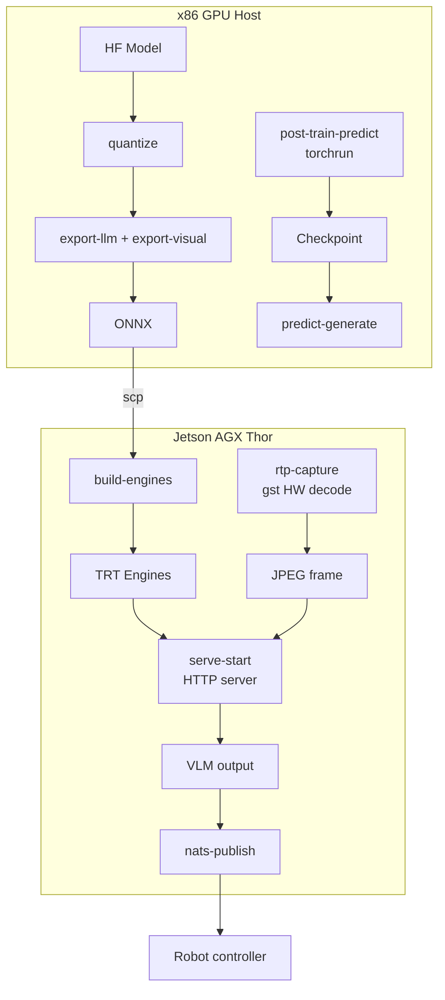

# Architecture

## One very clear idea

```
 Operator CLI         Strands Agent
      │                     │
      │  just <recipe>      │  cosmos_*()
      │                     │     │
      └─────────────────────┴─────┘
                                  ▼
                          ┌───────────────┐
                          │   justfile    │  ← EVERYTHING lives here
                          │  (42 recipes) │
                          └───────────────┘
                                  │
                  ┌───────────────┼───────────────┐
                  ▼               ▼               ▼
           tensorrt-edgellm-*   torchrun     curl/gst/nats
           (quant/export)      (train/distill) (serve/io)
```

**Rule #1**: if you need to run a command, it exists as a `just` recipe. Python never inlines shell logic.

## Why it works

| Problem | Solution |
|---|---|
| Agent + operator need the same commands | `justfile` is the single API |
| Cosmos upstream repos also use `just` | Match their muscle memory |
| Python tools get bloated | Each tool is ~30 lines (just `just_run(...)` + `proc_result(...)`) |
| Discovery is hard | `just --list` prints every recipe with docstrings |
| Pipelines chain | Meta-recipes compose atomic recipes |

## Directory layout

```
thor-cosmos/
├── justfile              ← 42 recipes (the command surface)
├── pyproject.toml        ← entry point: thor-cosmos
├── thor_cosmos/
│   ├── agent.py          ← while True: agent(input()) loop
│   └── tools/
│       ├── _common.py    ← ok() / err() / just_run() helpers
│       ├── inference.py  ← cosmos_inference (direct HTTP, not via just)
│       ├── serve.py      ← thin wrapper → just serve-*
│       ├── quantize.py   ← thin wrapper → just quantize
│       └── …             ← 19 tools total, same pattern
├── configs/
│   └── robot-vlm-client.example.yaml
├── docs/                 ← this site (mkdocs-material)
└── .env.example          ← dotenv-load is on
```

## Tool anatomy

Every tool follows the same 5-step pattern:

### 1. Recipe in `justfile`
```justfile
# Quantize a Cosmos VLM/LLM to FP8/INT8/INT4
quantize model_dir output_dir dtype="fp16" quantization="fp8":
    mkdir -p "{{output_dir}}"
    tensorrt-edgellm-quantize-llm \
      --model_dir "{{model_dir}}" \
      --output_dir "{{output_dir}}" \
      --dtype "{{dtype}}" --quantization "{{quantization}}"
```

### 2. Python wrapper
```python
@tool
def cosmos_quantize(
    model_dir: str,
    output_dir: str,
    dtype: str = "fp16",
    quantization: str = "fp8",
) -> dict:
    """Quantize a Cosmos VLM/LLM via `just quantize`."""
    proc = just_run("quantize", model_dir, output_dir, dtype, quantization,
                    timeout_s=60*60*3)
    return proc_result(
        proc,
        success_text=f"✅ quantized {model_dir} → {output_dir}",
        fail_text=f"quantization failed: {proc.get('stderr','')[:200]}",
    )
```

### 3. Register in `tools/__init__.py`
```python
from thor_cosmos.tools.quantize import cosmos_quantize
__all__ = [..., "cosmos_quantize"]
```

### 4. Add to `agent.py`
```python
return Agent(
    model=model,
    system_prompt=SYSTEM_PROMPT,
    tools=[..., cosmos_quantize],
)
```

### 5. Smoke test
```bash
python3 -c "import thor_cosmos"
just quantize nvidia/Cosmos-Reason2-2B ./out/q fp16 fp8
```

## The `ToolResult` contract

```python
{
  "status": "success" | "error",
  "content": [
    {"text": "human-readable summary"},                            # always
    {"json": {...structured data...}},                             # optional
    {"image": {"format": "jpeg", "source": {"bytes": b"..."}}},    # optional
  ],
}
```

**Image-producing tools** (`rtp_capture_frame`, `video_extract_frames`, `image_read`) **embed JPEG bytes** directly — the agent feeds them straight into `cosmos_inference` on the next turn. No "save to disk, tell agent the path" anti-pattern.

## `_common.py` helpers

- **`ok(text, data, image_path, image_bytes, image_format)`** — success result
- **`err(msg, data)`** — error result
- **`just_run(recipe, *args, timeout_s, extra_env)`** — run a recipe, normalize output
- **`proc_result(proc, success_text, fail_text)`** — convert subprocess dict → ToolResult
- **`run_proc(cmd, timeout_s, cwd, env)`** — legacy subprocess wrapper (for non-just paths)

## Four tool families

### Edge (Thor)
`cosmos_inference` · `cosmos_serve` · `cosmos_build_engine` · `rtp_capture_frame` · `nats_publish` · `system_info`

### x86 prep
`cosmos_quantize` · `cosmos_export_onnx` · `cosmos_model_download` · `cosmos_reason_hf`

### Generation
`cosmos_predict_generate` · `cosmos_transfer_generate`

### Training / Data / Eval
`cosmos_post_train` · `cosmos_distill` · `cosmos_curate` · `cosmos_evaluate`

### Utilities
`video_probe` · `video_extract_frames` · `image_read`

## Data flow


