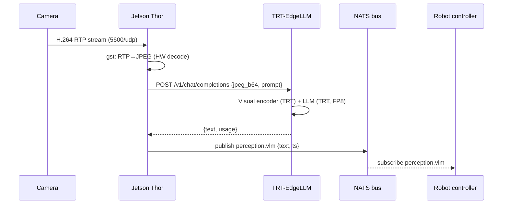

# intbot_edge_vlm · Thor Real-Time VLM

The flagship recipe. Deploys **Cosmos-Reason2** to **Jetson AGX Thor** for real-time robot perception with <200 ms/frame latency.

Adapted from [cookbook/intbot_edge_vlm](https://nvidia-cosmos.github.io/cosmos-cookbook/recipes/inference/reason2/intbot_edge_vlm/inference.html).

## Architecture



## Prerequisites

- x86 GPU host with `tensorrt-edgellm-*` CLI
- Jetson AGX Thor with TensorRT-LLM built
- RTP camera source (can be a laptop during testing)
- NATS server (optional, `docker run -p 4222:4222 nats`)

## Step 1 — Prep the model on x86

```bash
just prep-edge-model reason2-2b ./models/R2-fp8
# → ./models/R2-fp8/hf/        (HF weights, ~4 GB)
# → ./models/R2-fp8/quantized/ (FP8 weights, ~1.5 GB)
# → ./models/R2-fp8/onnx/      (LLM ONNX + visual encoder ONNX)
```

Copy ONNX to Thor:

```bash
scp -r ./models/R2-fp8/onnx cagatay@thor.local:~/R2-fp8-onnx
```

## Step 2 — Build engines on Thor

```bash
ssh cagatay@thor.local
cd ~/thor-cosmos
just build-engines ~/R2-fp8-onnx ~/R2-fp8-engines
# → ~/R2-fp8-engines/llm/     (TRT engine, ~1.8 GB)
# → ~/R2-fp8-engines/visual/  (TRT engine, ~800 MB)
```

Engine build takes **~20-30 minutes** on Thor — this is one-time.

## Step 3 — Serve

```bash
just serve-start ~/R2-fp8-engines/llm ~/R2-fp8-engines/visual
just serve-status
# 🟢 running pid=12345  http://127.0.0.1:8080
```

Tail logs:

```bash
just serve-logs 40
```

## Step 4 — Smoke test

```bash
# With a static image:
just infer assets/test.jpg "count people"
# "There are 3 people in the scene."

# With a live frame:
just rtp-capture 5600 /tmp/live.jpg 800 600 5
just infer /tmp/live.jpg "describe the scene in JSON"
```

## Step 5 — Real-time loop

```bash
tmux new -s perception
just perception-loop perception.vlm \
  "Describe the scene; count people; report clothing colors."
```

Expected throughput: **3-5 FPS** on Thor at 800×600 with 128-token output.

## Step 6 — Consume events

```bash
# In another terminal:
nats sub perception.vlm
# [#1] Received on "perception.vlm"
# {"text": "Two workers in high-vis vests...", "ts": 1715000000}
```

Or subscribe from the robot controller:

```python
import nats, json

async def on_msg(msg):
    data = json.loads(msg.data)
    print(data["text"])

async def main():
    nc = await nats.connect("nats://thor.local:4222")
    await nc.subscribe("perception.vlm", cb=on_msg)
```

## Tuning for latency

| Knob | Default | Latency-optimized |
|---|---|---|
| `max_tokens` | 256 | **64-128** |
| `temperature` | 0.2 | 0.0 |
| Prompt length | — | keep <300 chars |
| `max_image_tokens` (engine) | 10240 | **4096** if image is small |

## Troubleshooting

**`cannot reach VLM server`** → `just serve-status`. If 🔴, check `just serve-logs`.

**`no frame captured`** → verify `RTP_BIND` matches the interface the camera sends to. Try `hw_decode=False` indirectly by rebuilding with `avdec_h264` path (automatic fallback in recipe).

**High latency** → check `nvpmodel -q` is `MAXN_SUPER`; check thermals with `just sysinfo`.

**OOM building engine** → lower `max_image_tokens` or use a larger swap file.
