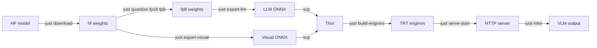

# Cosmos-Reason2 (VLM)

Cosmos-Reason2 is NVIDIA's vision-language-reasoning model for Physical AI. thor-cosmos supports it through three inference paths and the full edge-deployment pipeline.

## Inference paths

| Path | Tool | Recipe | Use when |
|---|---|---|---|
| **TRT-EdgeLLM server** (Thor) | `cosmos_inference` | `just infer` | Real-time, FP8, <200 ms/frame |
| **HuggingFace** (x86) | `cosmos_reason_hf` | — | Full precision reference, no server |
| **Direct HTTP** | `cosmos_inference` | — | Already have a server running |

## Edge deployment pipeline



## Agent tools

### `cosmos_inference`
```python
cosmos_inference(
    prompt="count people",
    image_path="/tmp/frame.jpg",      # or image_b64
    max_tokens=256,
    temperature=0.2,
    return_image=False,               # embed input image in result
)
```

Direct HTTP POST to the TRT-EdgeLLM server. Returns `latency_ms`, model output, optional image bytes.

### `cosmos_reason_hf`
```python
cosmos_reason_hf(
    prompt="describe the scene",
    image_path="test.jpg",            # or video_path
    model_id="nvidia/Cosmos-Reason2-2B",
    device="auto",
)
```

HuggingFace Transformers, full-precision, supports **video input** (auto-samples frames). x86 GPU only.

### `cosmos_serve`
```python
cosmos_serve(action="start",          # start|stop|restart|status|logs
             llm_engine_dir="~/engines/llm",
             visual_engine_dir="~/engines/visual",
             port=8080, host="127.0.0.1")
```

### `cosmos_quantize`
```python
cosmos_quantize(
    model_dir="nvidia/Cosmos-Reason2-2B",
    output_dir="./quantized/R2-fp8",
    dtype="fp16",
    quantization="fp8",               # fp8|int8|int4
)
```

### `cosmos_export_onnx`
```python
cosmos_export_onnx(
    model_dir="./quantized/R2-fp8",
    output_dir="./onnx",
    which_part="llm",                 # "llm" or "visual"
    dtype="fp16",
    quantization="fp8",               # visual only
)
```

### `cosmos_build_engine`
```python
cosmos_build_engine(
    onnx_dir="~/R2-fp8-onnx",
    engine_dir="~/R2-fp8-engines/llm",
    which_part="llm",                 # "llm" or "visual"
    min_image_tokens=4,
    max_image_tokens=10240,
    max_input_len=1024,
)
```

## The one-liner

```bash
# x86 host
just prep-edge-model reason2-2b ./models/R2-fp8

# Thor
just build-engines ~/R2-fp8-onnx ~/R2-fp8-engines
just serve-start ~/R2-fp8-engines/llm ~/R2-fp8-engines/visual
just infer /tmp/frame.jpg "describe the scene"
```

## Prompt engineering tips

- **Perception**: `temperature=0.0-0.2` for deterministic counts/labels
- **Description**: `temperature=0.3-0.5` for natural prose
- **Use system prompt** for consistent output schema:
  ```python
  cosmos_inference(
    prompt="count people",
    image_path="frame.jpg",
    system_prompt="Always respond as JSON: {people: N, clothing: [...]}",
  )
  ```

## Model zoo

| Model | Size | Deployment |
|---|---|---|
| Cosmos-Reason2-2B | 2B params | Thor (FP8) — **default** |
| Cosmos-Reason2-7B | 7B params | Thor (INT4) or x86 (FP8) |
| Cosmos-Reason1-7B-Reward | 7B | RL critic (x86) |

See [intbot_edge_vlm walkthrough](../examples/intbot-edge-vlm.md).
