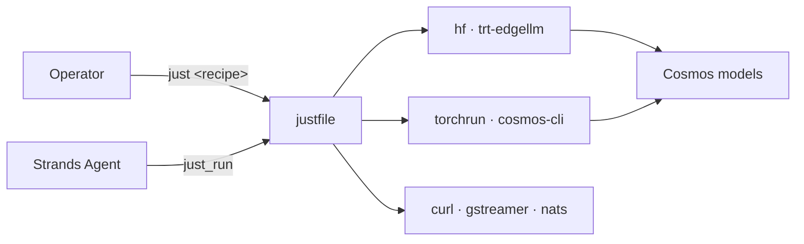

---
hide:
  - navigation
  - toc
---

<div align="center" markdown>


# thor-cosmos


> [**→ Visit the standalone landing page**](landing/index.html) for the marketing overview.
**NVIDIA Cosmos on Jetson AGX Thor — one `justfile`, one Strands agent, full lifecycle.**

[](https://pypi.org/project/thor-cosmos/)
[](https://python.org)
[](https://github.com/cagataycali/thor-cosmos/blob/main/LICENSE)
[](https://strandsagents.com)

</div>

---

## What is this?

A **Strands agent + `justfile`** that orchestrates the full NVIDIA Cosmos ecosystem — **Reason2** (VLM), **Predict2.5** (world model), **Transfer2.5** (ControlNet), **Xenna** (data curation) — and deploys it on **Jetson AGX Thor** for real-time robot perception.

```bash
pipx install thor-cosmos && thor-cosmos
```



---

## Why `justfile` as the command surface?

- Every Cosmos upstream repo (`cosmos-predict2.5`, `cosmos-transfer2.5`, `cosmos-reason2`, `cosmos-cookbook`) already ships a `justfile`. **Ours blends in.**
- **One source of truth**: agents shell out to `just <recipe>`; operators run `just <recipe>` directly. Zero duplication.
- **Thin Python tools** (~30 lines each) invoke a recipe and normalize output to a Strands `ToolResult`.
- **Discoverable**: `just --list` prints every pipeline step.
- **Composable**: meta-recipes (`pipeline-edge-deploy`) chain atomic recipes.

---

## Features

<div class="grid cards" markdown>

-   :material-brain:{ .lg } **Cosmos-Reason2 (VLM)**

    ---

    Real-time vision-language on Jetson Thor (FP8, TRT-EdgeLLM). Quantize, ONNX-export, engine-build, serve, infer.

    → [Reason2 guide](guide/reason2.md)

-   :material-video:{ .lg } **Cosmos-Predict2.5**

    ---

    World model / video generation: text→world, video→world, action-conditioned, multiview.

    → [Predict 2.5 guide](guide/predict25.md)

-   :material-palette:{ .lg } **Cosmos-Transfer2.5**

    ---

    ControlNet-style video transfer: edge, depth, seg, vis, multi-control.

    → [Transfer 2.5 guide](guide/transfer25.md)

-   :material-database:{ .lg } **Cosmos-Xenna**

    ---

    7-stage data curation: split → transcode → crop → filter → caption → dedup → shard.

    → [Xenna guide](guide/xenna.md)

-   :material-school:{ .lg } **Training & Distillation**

    ---

    Post-train Reason2 (SFT/RL), Predict2.5, Transfer2.5 via `torchrun`. Step-distill with KD / DMD2.

    → [Training guide](guide/training.md)

-   :material-chart-line:{ .lg } **12 Evaluation Metrics**

    ---

    FID, FVD, TSE, CSE, Sampson, blur-SSIM, Canny-F1, depth-RMSE, seg-mIoU, DOVER, Reason-critic, Reason-reward.

    → [Evaluation](guide/evaluation.md)

-   :material-robot:{ .lg } **Edge Deployment**

    ---

    GStreamer RTP capture (HW-accel), TRT-EdgeLLM HTTP server, NATS event publishing.

    → [Thor deployment](getting-started/thor-deploy.md)

-   :material-hammer-screwdriver:{ .lg } **19 Strands Tools**

    ---

    All tool calls normalized to `{status, content: [text, json, image]}`. Parallel-by-default.

    → [API reference](api-reference.md)

</div>

---

## The flagship pipeline

The **intbot_edge_vlm** cookbook recipe — deploy Cosmos-Reason2 to Thor for real-time robot perception:

```bash
# On x86 GPU host
just prep-edge-model reason2-2b ./models/R2-fp8
scp -r ./models/R2-fp8/onnx thor:~/R2-fp8-onnx

# On Thor
just build-engines ~/R2-fp8-onnx ~/R2-fp8-engines
just serve-start ~/R2-fp8-engines/llm ~/R2-fp8-engines/visual
just infer /tmp/frame.jpg "count people in the scene"

# Real-time loop
just perception-loop perception.vlm "describe the scene, count people"
```

[→ Full walkthrough](examples/intbot-edge-vlm.md)

---

## Quick links

<div class="grid" markdown>

- :material-rocket-launch: [**Install & Quickstart**](getting-started/installation.md) — 2-minute setup
- :material-map: [**Architecture**](architecture.md) — how tools, recipes and repos fit together
- :material-api: [**API Reference**](api-reference.md) — all 19 agent tools
- :material-school-outline: [**Cosmos Cookbook**](https://nvidia-cosmos.github.io/cosmos-cookbook/) — upstream recipes

</div>
